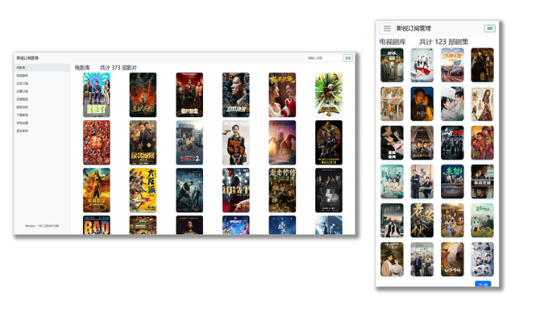

# MediaMaster
支持获取豆瓣最新想看，并且从高清剧集网和高清影视之家搜索自动下载电影和电视剧，并且自动重命名转移文件到媒体库中。

注意：源代码运行环境需要正确配置chromedriver，一般用户推荐使用Docker拉取latest版本进行部署。

**管理界面预览：**



**20241224更新日志：**
> 1.推送beta版本，支持多CPU架构平台。  \
> 2.修复豆瓣接口使用豆瓣ID和IMDB查询不到数据的问题，暂时改为使用标题进行查询。（可能是豆瓣API接口有限制）  \
> 3.修复一些其他已知问题。  \
> 4.重构部分Python程序，优化代码结构和程序运行逻辑。  \

**20241213更新日志：**
> 1.latest版本标签今后将推送经过beta版本测试后相对稳定的最新版本。  \
> 2.推送beta版本，该版本移除WebDriver方法，采用requests请求方法。测试稳定后将推送至latest  \
> 3.计划新增stable版本，今后将推送经过beta版本和latest版本测试稳定的版本推送到该版本标签进行更新。  \
> 4.移除WebDriver方法，改为requests请求方法，提高资源搜索和种子文件下载速度。  \
> 5.基于WebDriver方法的稳定版本1.6.3 (20241128)该版本及之前版本均基于WebDriver方法。如果需要可以拉取1.6.3版本，但后续不再提供维护及更新。

**20241128更新日志：**
> 1.新增下载管理功能，支持transmission下载器对下载任务进行简单的管理。

**20241121更新日志：**
> 1.修复手动搜索资源时点击下载按钮失效的问题。  \
> 2.修复cookie有效期未正确保存，导致关闭浏览器后再次打开需要重新登录的问题。  \
> 3.优化WEB界面中的一些显示效果。

**20241120更新日志：**
> 1.手动搜索资源时支持只使用关键词模糊搜索。  \
> 2.手动搜索资源结果支持以分辨率进行筛选。  \
> 3.修复部分已知的BUG。

**20241119更新日志：**
> 1.修复手动搜索资源并下载种子时下载目录不是Torrent目录的问题。  \
> 2.优化移动端豆瓣订阅信息WEB页面显示效果。

**20241118更新日志：**
> 1.修复首选分辨率及备用分辨率未从配置文件读取的问题。  \
> 2.修复自动搜索资源时排除关键字不生效的问题。  \
> 3.增加WEB登录时用户名密码错误的提示、登录页面增加版本号显示。

**20241115更新日志：**
> 1.优化WEB界面中的一些显示效果。  \
> 2.指定WebDriver默认下载到/Torrent目录。  \
> 3.提升文件转移时文件名的识别准确率。

**20241114更新日志：**
> 1.修复部分已知的BUG。  \
> 2.海报墙新增评分展示、在库剧集总集数展示。

**20241113更新日志：**
> 1.修复全新创建数据库后某些功能模块写入权限不足的问题。  \
> 2.修复“修改密码”界面标题字体大小不一致的问题。  \
> 3.增加文件转移时查询TMDB_ID的缓存，避免处理同一剧集时重复请求TMDB API接口。  \
> 4.修改主程序对停止信号的监测，确保接收到关闭信号时优雅地退出。

**20241112更新日志：**
> 1.重构程序运行逻辑，自建数据库不再依赖nas-tools。  \
> 2.增加简单的WEB管理界面，WEB管理：支持修改配置文件、支持管理正在订阅的剧集和电影、支持显示在库的电影和剧集、支持搜索在库影视资源、支持手动搜索资源和下载、支持手动运行服务、支持查看豆瓣最新想看。  \
> 3.在库的电影和剧集改为海报墙方式展示。  \
> 4.WEB管理支持响应式，以适配不同分辨率终端设备。  \
> 5.修复WEB管理：在库的电影和剧集无数据时程序异常崩溃的情况；完善部分消息提示功能。

### 推荐使用Docker Compose部署：
请替换volumes路径为实际路径。docker.cloudlayer.icu是docker镜像代理拉取地址，可以去除或更改为其他代理地址。
WEB管理信息：
> 默认端口：8888 \
> 使用浏览器访问：http://your-ip:8888 \
> 默认用户名：admin \
> 默认密码：P@ssw0rd

**（单独部署）mediamaster docker-compose.yml 如下：**
```
version: '3.8'
services:
  mediamaster:
    image: docker.cloudlayer.icu/smysong/mediamaster
    container_name: mediamaster
    environment:
      - UID=1000
      - GID=100
      - GIDLIST=100
    volumes:
      - /vol1/1000/Downloads:/Downloads
      - /vol1/1000/Torrent:/Torrent
      - /vol1/1000/Docker/mediamaster:/config
      - /vol1/1000/Media:/Media
    ports:
      - 8888:8888
    restart: always
    networks:
      media-network:

networks:
  media-network:
    driver: bridge
    enable_ipv6: true
    ipam:
      config:
        - subnet: 172.16.238.0/24
        - subnet: 2001:db8:1::/64
```
**（包含相关服务）docker-compose.yml 如下：**
```
version: '3.8'
services:
  emby:
    image: docker.cloudlayer.icu/amilys/embyserver:latest
    container_name: embyserver
    networks:
      media-network:
    environment:
      - UID=1000
      - GID=100
      - GIDLIST=100
    volumes:
      - /vol1/1000/Docker/emby/config:/config
      - /vol1/1000/Media:/Media
    ports:
      - 8096:8096
      - 8920:8920
    devices:
      - "/dev/dri/renderD128:/dev/dri/renderD128"
    restart: always

  tinymediamanager:
    image: docker.cloudlayer.icu/tinymediamanager/tinymediamanager:latest
    container_name: tinymediamanager
    networks:
      media-network:
    environment:
      - USER_ID=1000
      - GROUP_ID=100
      - ALLOW_DIRECT_VNC=true
      - LC_ALL=en_US.UTF-8
      - LANG=en_US.UTF-8
      - PASSWORD=password
    volumes:
      - /vol1/1000/Docker/tinymediamanager:/data
      - /vol1/1000/Media:/Media
    ports:
      - 5900:5900
      - 4000:4000
      - 7878:7878
    restart: unless-stopped

  mediamaster:
    image: docker.cloudlayer.icu/smysong/mediamaster:latest
    container_name: mediamaster
    networks:
      media-network:
    environment:
      - UID=1000
      - GID=100
      - GIDLIST=100
    volumes:
      - /vol1/1000/Downloads:/Downloads
      - /vol1/1000/Torrent:/Torrent
      - /vol1/1000/Docker/mediamaster:/config
      - /vol1/1000/Media:/Media
    ports:
      - 8888:8888
    restart: always

  transmission:
    image: docker.cloudlayer.icu/linuxserver/transmission:latest
    container_name: transmission
    networks:
      media-network:
    environment:
      - PUID=1000
      - PGID=1000
      - TZ=Etc/UTC
      - TRANSMISSION_WEB_HOME= #optional
      - USER= #optional
      - PASS= #optional
      - WHITELIST= #optional
      - PEERPORT= #optional
      - HOST_WHITELIST= #optional
    volumes:
      - /vol1/1000/Docker/transmission:/config
      - /vol1/1000/Downloads:/downloads
      - /vol1/1000/Torrent:/watch
    ports:
      - 9091:9091
      - 51413:51413
      - 51413:51413/udp
    restart: unless-stopped

networks:
  media-network:
    driver: bridge
    enable_ipv6: true
    ipam:
      config:
        - subnet: 172.16.238.0/24
        - subnet: 2001:db8:1::/64
```

### CLI手动部署：
### 步骤 1: 拉取镜像
**首先，你需要从 Docker Hub 拉取镜像。假设你已经在一台安装了 Docker 的机器上：**


```
docker pull smysong/mediamaster:latest
```


这将下载 smysong/mediamaster:latest 镜像到本地。

### 步骤 2: 运行镜像
**接下来，你可以运行这个镜像。需要挂载一些配置文件或数据卷，你需要指定适当的挂载点。以下是一个示例命令，用于运行镜像，并挂载配置文件和数据卷：**


```
docker run -it --name mediamaster \
           -v /path/to/config:/config \
           -v /Media:/Media \
           -v /Torrent:/Torrent \
           -v /Downloads:/Downloads \
           smysong/mediamaster:latest
```

在这个命令中：

> -it \
> 表示以交互模式运行容器，并分配一个伪TTY。
> 
> --name mediamaster \
> 给容器命名。
>  
> -v /path/to/config:/config \
> 在主机上新建config 目录挂载到容器的 /config 目录，用于存放配置文件。
>  
> -v /Media:/Media \
> 将主机上的媒体根目录挂载到容器的/Media目录，用于扫描本地媒体库文件和nfo文件。
>  
> -v /Torrent:/Torrent \
> 在主机上新建Torrent 目录挂载到容器的 /Torrent 目录，用于存放下载的种子文件。
> 
> -v /Downloads:/Downloads \
> 目录监控，将主机上下载器的下载目录挂载到容器/Downloads目录，可以实现自动转移并重命名下载完成的影片文件。
>  
> smysong/mediamaster:latest \
> 是要运行的镜像名称。


**配置config.ini，默认会自动创建配置文件，在WEB管理中自行进行修改或直接修改配置文件。配置文件参数如下：**


```
[database]
db_path = /config/data.db #数据库路径，保持默认即可

[notification]
notification_api_key = Bark-api_key #Bark通知密钥

[nfo]
exclude_dirs = Season,Movie,Music,Unknown,backdrops,.actors,.deletedByTMM #nfo文件演员汉化排除目录
excluded_filenames = season.nfo,video1.nfo #nfo文件演员汉化排除文件名
excluded_subdir_keywords = Season,Music,Unknown,backdrops,.actors,.deletedByTMM #nfo文件演员汉化排除子目录关键字

[mediadir]
directory = /Media #媒体根目录
movies_path = /Media/Movie #电影目录
episodes_path = /Media/Episodes #电视剧目录

[downloadtransfer]
directory = /Downloads  #下载文件转移监控目录
action = copy  #下载文件转移方式，支持复制（copy）和移动（move）
excluded_filenames = #下载文件转移排除文件名

[douban]
api_key = 0ac44ae016490db2204ce0a042db2916 #豆瓣API，保持默认
cookie = your_douban_cookie_here #豆瓣cookie，选填非必要
rss_url = https://www.douban.com/feed/people/user-id/interests #豆瓣最新想看，更改为自己的user-id

[tmdb]
base_url = https://api.tmdb.org/3 #tmdb-api请求地址，使用默认地址或改为代理地址
api_key = your_api_key #tmdb-api密钥，改为自己的密钥

[emby]
emby_api_key = your_api_key #emby-api密钥，改为自己的密钥
emby_refresh_url = http://your-ip:your-port/Library/Refresh #emby刷新媒体库地址，改为自己的emby服务器ip地址和端口

[tmm]
tmm_api_key = your_api_key #tmm-api密钥，改为自己的密钥
tmm_url = http://your-ip:your-port/api/ #tmm-api接口地址，改为自己的tmm ip地址和端口。

[download_mgmt]
download_mgmt = True #开启下载管理
download_mgmt_url = http://your_transmission_ip:port #transmission管理IP和端口号

[resources]
login_username = username #高清影视之家和高清剧集网的登录用户名
login_password = password #高清影视之家和高清剧集网的登录密码
preferred_resolution = 2160p #资源首选分辨率
fallback_resolution = 1080p #资源备用分辨率
exclude_keywords = 60帧,高码版 #排除包含此关键字的资源

[urls]
movie_login_url = https://100.tudoutudou.top/member.php?mod=logging&action=login #高清影视之家登录地址
tv_login_url = https://200.tudoutudou.top/member.php?mod=logging&action=login #高清剧集网登录地址
movie_search_url = https://100.tudoutudou.top/search.php?mod=forum #高清影视之家搜索地址
tv_search_url = https://200.tudoutudou.top/search.php?mod=forum #高清剧集网搜索地址

[running]
run_interval_hours = 6 #程序自动运行间隔时长，默认6小时


```

**容器运行成功后可通过日志查看运行情况，并且配置qBittorrent或Transmission 等下载工具监听主机上的torrent目录，发现新的种子文件后将自动下载。**

### 步骤 3: 登录WEB管理
> 默认端口：8888 \
> 容器支持host模式或bridge模式 \
> 使用浏览器访问：http://your-ip:8888 \
> 默认用户名：admin \
> 默认密码：P@ssw0rd
